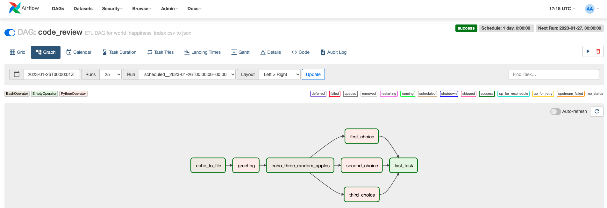
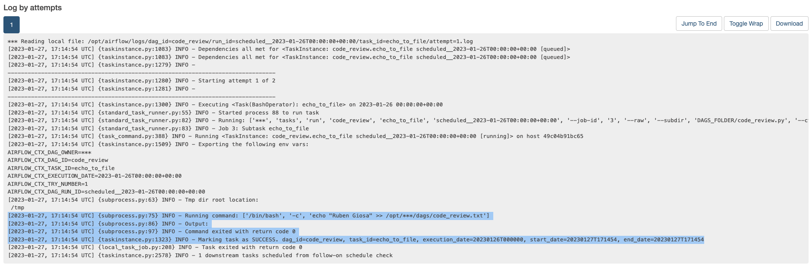
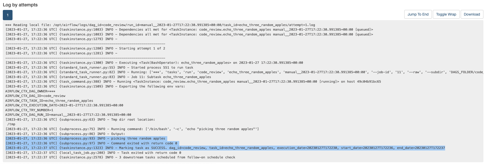
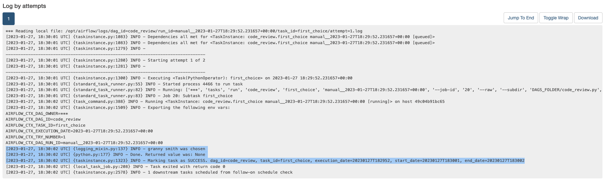
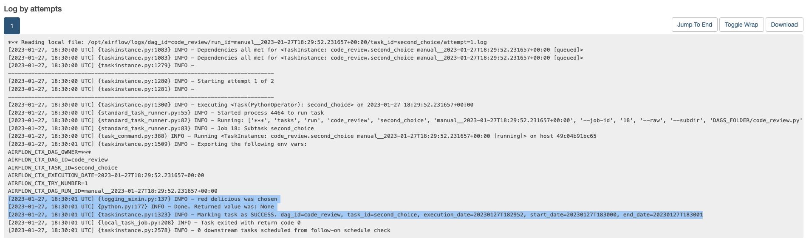
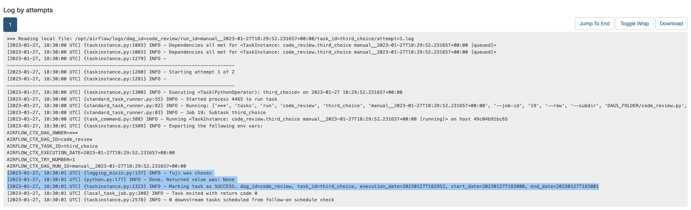

# Code Review: Airflow 1

#### By [Ruben Giosa](https://www.linkedin.com/in/rubengiosa/)

#### This repo showcases the creation of a simple DAG to work with Airflow, leveraging setup files to streamline setup process as well, basic commands to properly run Airflow leveraging Docker.

<br>

## Technologies Used

* Airflow
* Docker
* Python
* Git
* Markdown
* `.gitignore`
* `requirements.txt`

</br>

## Description

For this project, I made a very simple DAG that a user can run on the Airflow graphical interface. It uses Bash to echo a user's name, save the echoed value as a text file, then uses Python to read and print the value in that file. Then, it runs three simultaneous tasks that each print a different random value from a list. The DAG finishes with an empty operator.

#### DAG Structure:


Logs of each of the successful tasks:












Task 7 is a `DummyOperator` to showcase the use of the operator for this DAG (Note: this task is evaluated by the scheduler but never processed by the executor) 

<br>

## Setup/Installation Requirements

* Go to https://github.com/rgiosa10/airflow_1_cr.git to find the specific repository for this website.
* Then open your terminal. I recommend going to your Desktop directory:
    ```bash
    cd Desktop
    ```
* Then clone the repository by inputting: 
  ```bash
  git clone https://github.com/rgiosa10/airflow_1_cr.git
  ```
* Go to the new directory or open the directory folder on your desktop:
  ```bash
  cd airflow_1_cr
  ```
* open the directory in VS Code:
  ```bash
  code .
  ```
* Once VS Code is open, then run the setup file:
  ```bash
  ./setup.sh
  ```

    The contents of the `setup.sh` include the below to install 1) relevant version of python 2) create virtual env 3) installing Airflow in virtual env and 4) requirements.txt:
    ```bash
    #/bin/bash
    # this script will setup the environment and install all necessary components 

    # install/upgrade virtualenv
    python3.7 -m pip install --upgrade virtualenv

    # create and run a python3.7 virtual env
    python3.7 -m venv venv
    source venv/bin/activate
    # install/upgrade pip
    python3.7 -m pip install --upgrade pip setuptools wheel

    # install Airflow in the virtual env
    AIRFLOW_VERSION=2.3.2
    PYTHON_VERSION=3.7
    CONSTRAINT_URL="https://raw.githubusercontent.com/apache/airflow/constraints-${AIRFLOW_VERSION}/constraints-${PYTHON_VERSION}.txt"
    pip install "apache-airflow[async,postgres,google]==${AIRFLOW_VERSION}" --constraint "${CONSTRAINT_URL}"

    # pip install pypi packages
    pip install -r requirements.txt
    ```

* Then run the airflow setup file:

  ```bash
  ./airflow_setup.sh
  ```
    
    The contents of the `airflow_setup.sh` include the below to 1) creating ./logs and ./plugins directories in the dsa-airflow directory 2) download the `docker_compose.yaml` 3) create the .env and 4) initialize airflow
    
```bash
    #!/bin/bash
    # Move into the dsa-airflow directory and make subdirs
    cd dsa-airflow
    mkdir ./logs ./plugins

    # download the docker-compose.yaml and set the .env
    curl -LfO 'https://airflow.apache.org/docs/apache-airflow/stable/docker-compose.yaml'
    echo -e "AIRFLOW_UID=$(id -u)\nAIRFLOW_GID=0" > .env


    # initialize airflow 
    docker-compose up airflow-init
```

* Once setups have been completed, you will want to be using the below commands to manage airflow and docker:
    1. Once airflow has been initialized, use the below command line tool that allows you to initialize the rest of the Docker containers:
        ```bash
        docker-compose up
        ```
    2. In order to shut down hit `^Ctrl C` to stop Airflow on the local host and then run the below to stop the containers and remove old volumes:
        ```bash
        docker-compose down --volumes --remove-orphans 
        ```

</br>

## Known Bugs

* No known bugs

<br>

## License

MIT License

Copyright (c) 2022 Ruben Giosa, Reed Carter, Chloe (Yen Chi) Le

Permission is hereby granted, free of charge, to any person obtaining a copy of this software and associated documentation files (the "Software"), to deal in the Software without restriction, including without limitation the rights to use, copy, modify, merge, publish, distribute, sublicense, and/or sell copies of the Software, and to permit persons to whom the Software is furnished to do so, subject to the following conditions:

The above copyright notice and this permission notice shall be included in all copies or substantial portions of the Software.

THE SOFTWARE IS PROVIDED "AS IS", WITHOUT WARRANTY OF ANY KIND, EXPRESS OR IMPLIED, INCLUDING BUT NOT LIMITED TO THE WARRANTIES OF MERCHANTABILITY, FITNESS FOR A PARTICULAR PURPOSE AND NONINFRINGEMENT. IN NO EVENT SHALL THE AUTHORS OR COPYRIGHT HOLDERS BE LIABLE FOR ANY CLAIM, DAMAGES OR OTHER LIABILITY, WHETHER IN AN ACTION OF CONTRACT, TORT OR OTHERWISE, ARISING FROM, OUT OF OR IN CONNECTION WITH THE SOFTWARE OR THE USE OR OTHER DEALINGS IN THE SOFTWARE.

</br>